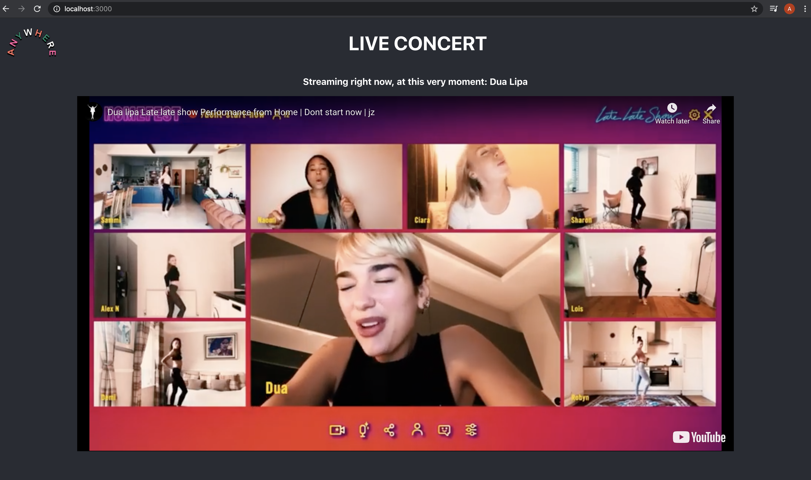
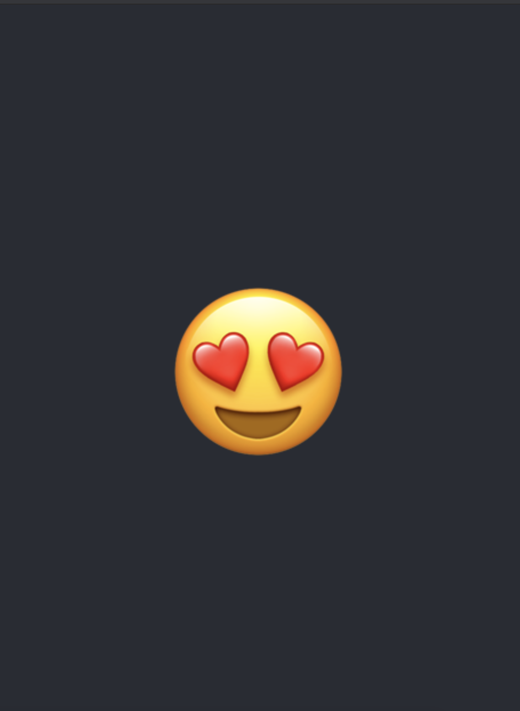

Clone the project and navigate into the correct folder.
Make sure you have npm installed 

## Set up backend
cd api
npm install
npm start 

Runs the app in the development mode. 
Open [http://localhost:8000](http://localhost:8000) to view it in the browser.

## Set up frontend
cd frontend
npm install
npm start

Runs the app in the development mode. 
Open [http://localhost:3000](http://localhost:3000) to view it in the browser.

The page will reload if you make edits. 

To use the platform with web and phone, check the ip-address at your machine and change "IPAdress" and "ENDPOINT" in all files to your IP-adress. To use it on you phone, type the IP-adress + :3000 (example: http://192.168.1.191:3000') in your browser. If you click the emoji, the emojis should pop up at the site at your computer.

What the platform looks like at the computer screen:

What the platform looks like at the phone screen:

